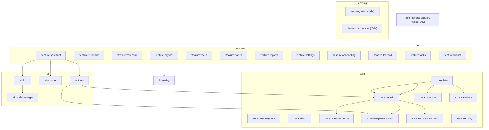

<div dir="rtl">

# روزبان (Roozban) — سند معماری و برنامه‌ی فازبندی (فاز ۰)

> وضعیت: **پیش‌نویس برای تأیید**. در این فاز هیچ کدی نوشته نمی‌شود. تصمیم‌هایی که به تأیید شما نیاز دارند در بخش ۱۶ آمده‌اند و هر کدام یک گزینه‌ی پیشنهادی دارند.

---

## ۱. اصول راهنما

1. **آفلاین‌محور (Offline-first):** همه‌ی داده‌ها و همه‌ی استنتاج‌ها روی گوشی انجام می‌شوند. شبکه فقط برای دانلود مدل‌ها و لایسنس استفاده می‌شود.
2. **هسته بدون هوش مصنوعی کامل است:** ثبت کار، یادآوری، تقویم و parser زمان فارسی، همه بدون مدل زبانی کار می‌کنند. دستیار یک «لایه‌ی افزوده» است، نه وابستگی.
3. **مدل زبانی هرگز محاسبه‌ی تاریخ نمی‌کند:** مدل فقط *نیت* و *عبارت زمانی خام* (مثل «پس‌فردا عصر») را برمی‌گرداند و محاسبه‌ی دقیق را parser قطعی ما انجام می‌دهد. مدل‌های کوچک در حساب تاریخ ضعیف‌اند و این جداسازی خطا را حذف می‌کند.
4. **منطق خالص در ماژول‌های JVM:** تقویم شمسی، parser زمان، RRULE، streak، مدل‌های آماری و زمان‌بندی خودکار ماژول‌های Kotlin/JVM خالص هستند. تست‌هایشان بدون شبیه‌ساز و در چند ثانیه اجرا می‌شود.
5. **هر عمل قابل برگشت است:** همه‌ی تغییرات، چه از UI و چه از دستیار، از مسیر Command با عمل معکوس (Undo) عبور می‌کنند.
6. **داده‌ی کاربر هرگز قفل نمی‌شود:** قفل Pro فقط روی *قابلیت‌ها* اعمال می‌شود، نه روی خواندن یا خروجی گرفتن از داده.

---

## ۲. نمای کلی معماری

- الگو: **Clean Architecture + MVVM (UDF)**
  - `UI (Compose)` ⟵ `ViewModel (StateFlow<UiState>)` ⟵ `UseCase (domain)` ⟵ `Repository (interface در domain، پیاده‌سازی در data)` ⟵ `DataSource (Room / DataStore / Native)`
- تزریق وابستگی: **Hilt**
- همروندی: Coroutines + Flow. dispatcherهای تزریق‌شونده (`@IoDispatcher`، `@DefaultDispatcher`) و یک dispatcher تک‌نخی اختصاصی برای استنتاج.
- ناوبری: Navigation Compose با routeهای type-safe (Kotlin Serialization)
- ساختار Gradle: چندماژولی، **Version Catalog** و **Convention Plugins** در `build-logic/`



---

## ۳. ساختار ماژول‌ها

| ماژول | نوع | مسئولیت |
|---|---|---|
| `:app` | Android app | Application، MainActivity، نمودار ناوبری، flavorهای فروشگاه، Manifest، ماژول‌های Hilt سطح بالا |
| `:core:common` | JVM | `Result`، dispatcherها، `Clock` قابل تزریق (برای تست زمان) |
| `:core:model` | JVM | مدل‌های دامنه (`Task`، `Project`، `Reminder` و ...). بدون وابستگی به Android |
| `:core:calendar` | JVM | تبدیل شمسی ⇄ میلادی ⇄ قمری، هفته‌ی شنبه‌محور، تعطیلات، قالب‌بندی و ارقام فارسی |
| `:core:timeparser` | JVM | parser قاعده‌محور عبارات زمانی فارسی (بخش ۶) |
| `:core:recurrence` | JVM | موتور RRULE (زیرمجموعه‌ی RFC 5545 به‌علاوه‌ی `RSCALE=PERSIAN`) |
| `:core:domain` | JVM | UseCaseها و اینترفیس Repositoryها |
| `:core:database` | Android | Room: Entityها، DAOها، Migrationها، FTS برای جستجو |
| `:core:datastore` | Android | تنظیمات (Proto DataStore) |
| `:core:data` | Android | پیاده‌سازی Repositoryها و Command/Undo |
| `:core:alarm` | Android | `AlarmScheduler`، Receiverها (Boot، TimeChange، Snooze)، کانال‌های اعلان |
| `:core:security` | Android | Keystore، AES-GCM، Argon2id (برای پشتیبان) |
| `:core:designsystem` | Android | تم M3، فونت Vazirmatn، توکن‌های رنگ، کامپوننت‌ها، انیمیشن‌ها |
| `:core:ui` | Android | کامپوننت‌های مشترک صفحه‌ها (TaskRow، DatePicker شمسی و ...) |
| `:core:testing` | Android/JVM | fakeها، `TestClock`، ابزار تست DB |
| `:feature:*` | Android | هر قابلیت شامل Screen، ViewModel و ناوبری خودش |
| `:ai:llm` | Android + NDK | JNI روی llama.cpp، اینترفیس `LlmEngine`، سرویس فرایند `:ai` |
| `:ai:whisper` | Android + NDK | JNI روی whisper.cpp، ضبط صدا، VAD |
| `:ai:tools` | JVM | schema ابزارها، تولید GBNF، اعتبارسنجی، اجراکننده، سطح ریسک |
| `:ai:prompt` | JVM | ساخت prompt، بودجه‌ی توکن، تزریق حافظه و زمینه |
| `:ai:modelmanager` | Android | manifest مدل‌ها، دانلود قابل ادامه، checksum، انتخاب بر اساس RAM |
| `:ai:speech-output` | JVM | اینترفیس `SpeechOutput` (فعلاً NoOp) برای افزونه‌ی TTS آینده |
| `:learning:stats` | JVM | ضریب تخمین، ساعات پربازده، احتمال عقب‌افتادن |
| `:learning:scheduler` | JVM | الگوریتم چیدن کارها در زمان‌های خالی |
| `:learning:worker` | Android | Workerهای شبانه |
| `:licensing` | Android | وضعیت trial و لایسنس، ساعت امن، ذخیره‌ی رمزنگاری‌شده، `Entitlements` |
| `:billing:api` | JVM | اینترفیس `BillingGateway` |
| `app/src/bazaar`، `app/src/myket`، `app/src/dev` | flavor | پیاده‌سازی Poolakey، Myket IAB و Fake |
| `server/` | Python | FastAPI (بخش ۱۲) |
| `tools/eval/` | Python | ارزیابی مدل‌ها روی مجموعه‌ی تست فارسی (روی دسکتاپ) |

قاعده‌ی وابستگی: `feature` فقط به `domain`، `designsystem` و `ui` وابسته است. `feature`ها به همدیگر وابسته نیستند و ارتباطشان از طریق ناوبری است. ماژول‌های JVM به Android وابسته نیستند.

---

## ۴. مدل داده (Room)

زمان‌ها به‌صورت **epoch millis (UTC)** به‌همراه `zoneId` ذخیره می‌شوند. کارهای «تمام‌روز» به‌جای آن `epochDay` (تاریخ محلی) دارند تا تغییر منطقه‌ی زمانی آن‌ها را جابه‌جا نکند. کلید اصلی‌ها UUID هستند (برای ادغام پشتیبان و آینده‌ی sync).

| جدول | فیلدهای کلیدی |
|---|---|
| `task` | id، title، notes، projectId، parentId (زیرکار)، important، urgent (آیزنهاور)، dueAt/dueEpochDay، scheduledStart، estimateMin، actualMin، status، completedAt، rrule، seriesId، sortKey، createdAt، updatedAt، deletedAt (حذف نرم) |
| `project` | id، name، color، icon، archived، sortKey |
| `label` + `task_label` | رابطه‌ی چند‌به‌چند |
| `reminder` | id، taskId، triggerAt، kind (NOTIFICATION/ALARM)، snoozeUntil، state |
| `task_completion` | سابقه‌ی انجام کارهای تکراری |
| `time_entry` | taskId، start، end، source (FOCUS/MANUAL/INFERRED) |
| `focus_session` | start، plannedMin، actualMin، interrupted، taskId |
| `habit` + `habit_log` | زمان‌بندی (روزانه/روزهای خاص/X بار در هفته)، ثبت روزانه، freeze |
| `memory_fact` | key، value (متن فارسی)، source (USER/INFERRED/ASSISTANT)، confidence، pinned، updatedAt |
| `stat_param` | kind، categoryKey، value، n، updatedAt |
| `chat_message` | تاریخچه‌ی کوتاه گفتگو (قابل پاک‌سازی) |
| `action_log` | Commandهای اجراشده برای Undo و ممیزی اقدامات دستیار |
| `holiday` | epochDay، title، kind (رسمی/مذهبی)، dataVersion |
| `task_fts` | FTS4 برای جستجوی سریع فارسی (با عادی‌سازی ی/ک) |

**کارهای تکراری:** هر سری یک ردیف با `rrule` است. با انجام هر نوبت، رکوردی در `task_completion` ثبت و موعد به نوبت بعد منتقل می‌شود (مشابه Todoist). نمای تقویم نوبت‌های آینده را به‌صورت مجازی گسترش می‌دهد. ویرایش «فقط این نوبت» یک استثنا (EXDATE) و یک کار مستقل می‌سازد.

---

## ۵. تقویم و الزامات فارسی

- **شمسی:** پیاده‌سازی Kotlin خالص با الگوریتم Borkowski (همان الگوریتم کتابخانه‌ی `jalaali-js` با مجوز MIT) که در بازه‌ی عملی با تقویم رسمی ایران منطبق است. تست‌های متقابل با `android.icu.util.PersianCalendar` و فهرست کبیسه‌های معلوم انجام می‌شود.
- **قمری:** قمری رسمی ایران بر پایه‌ی رؤیت هلال است و با Umm al-Qura گاهی یک روز اختلاف دارد. پیشنهاد: نمایش با ICU (`islamic-umalqura`) به‌همراه تنظیم دستی ±۱ روز. تعطیلات مذهبی از فایل داده خوانده می‌شوند، نه از محاسبه.
- **تعطیلات:** فایل JSON نسخه‌دار، امضاشده با Ed25519، برای ۱۴۰۴ تا ۱۴۰۶ داخل برنامه. به‌روزرسانی همراه manifest مدل‌ها از همان کانال دانلود انجام می‌شود (تصمیم ۷).
- **هفته:** شروع از شنبه. جمعه (و در صورت تنظیم، پنجشنبه) تعطیل آخر هفته است.
- **RTL و فونت:** زبان برنامه به‌صورت ثابت `fa-IR` تنظیم می‌شود (`AppCompatDelegate.setApplicationLocales`). فونت Vazirmatn متغیر (OFL) داخل برنامه است. همه‌ی آیکن‌های جهت‌دار برای RTL قرینه می‌شوند.
- **ارقام:** نمایش همیشه با ارقام فارسی. ورودی ارقام فارسی، عربی و لاتین را می‌پذیرد و عادی‌سازی می‌کند. متن فارسی با ی/ک فارسی و نیم‌فاصله‌ی درست ذخیره می‌شود.
- **DatePicker شمسی اختصاصی** در Compose (تقویم ماهانه با نمایش تعطیلات).

---

## ۶. parser عبارات زمانی فارسی (`:core:timeparser`)

خط لوله:

1. **عادی‌سازی:** یکسان‌سازی ارقام، ي→ی، ك→ک، نیم‌فاصله و فاصله‌ها. تبدیل شکل‌های محاوره‌ای («دیگه»→«دیگر»، «فردا صب»→«فردا صبح»، «۵ و نیم»). تبدیل عددهای حروفی («دو»، «بیست و پنج»، «نیم»، «ربع»).
2. **توکن‌سازی و تطبیق قواعد** با parser combinator سبک. خروجی این مرحله یک **AST** است، نه تاریخ نهایی:
   - `RelativeOffset(amount, unit)`: «دو ساعت دیگر»، «سه روز بعد»
   - `DayAnchor`: امروز، فردا، پس‌فردا، دیروز
   - `Weekday(day, weekShift)`: «شنبه»، «سه‌شنبه‌ی بعد»، «جمعه‌ی این هفته»
   - `PartOfDay`: صبح، ظهر، بعدازظهر، عصر، غروب، شب، نیمه‌شب (ساعت پیش‌فرض هر کدام در تنظیمات قابل تغییر است)
   - `ClockTime(h, m, meridiemHint)`
   - `MonthAnchor`: «آخر ماه»، «اول ماه بعد»، «۱۵ اردیبهشت»، «نیمه‌ی خرداد»
   - `Duration`: «۳۰ دقیقه»، «یک ساعت و نیم» (برای تخمین زمان)
   - `Recurrence`: «هر روز»، «هر دوشنبه»، «یک روز در میان»، «آخر هر ماه» ⟵ تبدیل به RRULE
3. **Resolver:** با ورودی AST، `Clock` و ترجیحات کاربر، خروجی `ResolvedTime(instant | epochDay, confidence, matchedSpans)` تولید می‌کند. `matchedSpans` برای هایلایت زنده در ثبت سریع و حذف عبارت زمانی از عنوان کار به کار می‌رود.

قواعد ابهام (قابل تغییر در تنظیمات):

- «ساعت ۵» بدون قرینه: نزدیک‌ترین وقوع آینده در بازه‌ی ۷ تا ۲۲. ساعت ۵ در ساعت ۱۰ صبح یعنی ۱۷:۰۰.
- «X‌ی بعد/آینده»: روز X در **هفته‌ی تقویمی بعد** (هفته‌ی شنبه‌محور). «X» تنها: نزدیک‌ترین X آینده.
- «آخر ماه»: آخرین روز ماه **شمسی** جاری. اگر امروز روز آخر است، همان امروز.

**کمک مدل زبانی:** وقتی `confidence` زیر آستانه است و دستیار فعال است، مدل فقط **AST ساختاریافته** (JSON محدود به grammar) تولید می‌کند و Resolver باز هم همان کد قطعی است.
تست: بیش از ۳۰۰ مورد جدولی (عبارت، زمان مرجع، خروجی مورد انتظار) و property-based test برای تبدیل تقویم.

---

## ۷. یادآوری و آلارم (`:core:alarm`)

- **زمان‌بندی:** یادآوری‌های نوع ALARM با `setAlarmClock` (بالاترین اطمینان و نمایش در status bar) و بقیه با `setExactAndAllowWhileIdle` زمان‌بندی می‌شوند. فقط یادآوری‌های ۷ روز آینده ثبت می‌شوند تا به سقف حدود ۵۰۰ آلارم برای هر برنامه نرسیم. یک `ReconcileWorker` روزانه و رویدادهای زیر مجموعه را هماهنگ نگه می‌دارند.
- **Receiverها:** `BOOT_COMPLETED`، `MY_PACKAGE_REPLACED`، `TIME_SET`، `TIMEZONE_CHANGED`، `SCHEDULE_EXACT_ALARM_PERMISSION_STATE_CHANGED`. هر کدام با `goAsync()` و بدون کار سنگین روی نخ اصلی اجرا می‌شوند.
- **مجوزها:** `POST_NOTIFICATIONS` (اندروید ۱۳ به بعد) و exact alarm. هر دو با صفحه‌ی توضیح فارسی قبل از درخواست. اگر مجوز داده نشود، برنامه به‌صورت خودکار به `setWindow` برمی‌گردد و بنری با توضیح دقیق‌تر نبودن یادآوری نشان می‌دهد (تصمیم ۴).
- **آلارم تمام‌صفحه:** از `USE_FULL_SCREEN_INTENT` استفاده می‌شود، همراه با بررسی `canUseFullScreenIntent()` در اندروید ۱۴ به بعد.
- **تعویق:** actionهای اعلان (۵ و ۱۵ دقیقه، ۱ ساعت، «فردا صبح»، سفارشی) به یک Receiver می‌روند که Command را اجرا و آلارم را بازنشانی می‌کند.
- **بهینه‌سازی باتری:** صفحه‌ی راهنما بر اساس `Build.MANUFACTURER` (Xiaomi/MIUI/HyperOS، Samsung، Huawei/EMUI، Oppo/ColorOS، Vivo، OnePlus، Realme و عمومی) با Intentهای مستقیم به صفحه‌ی تنظیمات مربوط، در صورت وجود، و راه‌حل جایگزین در صورت نبود. برنامه با `isIgnoringBatteryOptimizations` وضعیت را نشان می‌دهد و در صورت نیاز درخواست استثنا می‌کند.
- **خودتشخیصی:** اگر آلارمی دیرتر از ۲ دقیقه اجرا شود، ثبت می‌شود و راهنمای باتری دوباره پیشنهاد داده می‌شود.

---

## ۸. UI/UX

- Material 3 با پالت اختصاصی روزبان، حالت روشن و تاریک و رنگ پویا (اندروید ۱۲ به بعد) به‌عنوان گزینه.
- **ثبت سریع در کمتر از ۵ ثانیه:** یک FAB یک BottomSheet با کیبورد باز باز می‌کند. هایلایت زنده‌ی توکن‌ها به‌صورت chip نمایش داده می‌شود: زمان، `#پروژه`، `@برچسب`، `!` برای اولویت و «~۳۰ دقیقه» برای تخمین. با Enter کار ذخیره می‌شود. مسیرهای دیگر: ویجت، Quick Settings Tile، App Shortcut، Share و action «کار جدید» در اعلان ثابت (اختیاری).
- انیمیشن‌ها: shared element بین لیست و جزئیات، `animateItem` در لیست‌ها و هپتیک ملایم هنگام تیک زدن.
- ویجت: Jetpack **Glance** (لیست امروز و دکمه‌ی +).
- **اهداف کارایی:** اجرای سرد زیر ۸۰۰ms روی دستگاه میان‌رده (با Baseline Profile) و اسکرول ۶۰fps.

---

## ۹. دستیار هوشمند

### ۹.۱ مقایسه‌ی مدل‌ها (GGUF، Q4_K_M)

> اعداد حجم تقریبی هستند و سرعت و کیفیت فارسی باید با مجموعه‌ی ارزیابی خودمان (بخش ۹.۷) اندازه‌گیری شود. این جدول مبنای انتخاب اولیه است و انتخاب نهایی در فاز ۴ انجام می‌شود. تا آن زمان مدل‌های جدیدتر هم بررسی می‌شوند.

| مدل | پارامتر | حجم Q4 | RAM لازم (تقریبی) | فارسی | tool-calling | مجوز |
|---|---|---|---|---|---|---|
| Qwen3-1.7B-Instruct | 1.7B | ~1.1 GB | ~1.8 GB | متوسط رو به خوب | خوب (آموزش‌دیده) | Apache 2.0 |
| Qwen3-4B-Instruct | 4B | ~2.5 GB | ~3.5 GB | خوب | خیلی خوب | Apache 2.0 |
| Gemma 3 1B-it | 1B | ~0.8 GB | ~1.3 GB | متوسط | ضعیف | Gemma Terms |
| Gemma 3 4B-it | 4B | ~2.5 GB | ~3.5 GB | **خوب (پشتیبانی چندزبانه‌ی گسترده)** | متوسط | Gemma Terms |
| Llama 3.2 3B-Instruct | 3B | ~2.0 GB | ~3 GB | ضعیف (فارسی رسماً پشتیبانی نمی‌شود) | خوب | Llama Community |
| Phi-4-mini-instruct | 3.8B | ~2.4 GB | ~3.3 GB | متوسط | خوب | MIT |

**پیشنهاد:**

- **سطح پیش‌فرض (RAM بین ۴ و ۸ گیگ):** `Qwen3-1.7B` با حالت thinking خاموش. حجم کم، مجوز آزاد و آموزش مخصوص فراخوانی ابزار دارد.
- **سطح قوی (RAM ۸ گیگ و بیشتر):** `Qwen3-4B` یا `Gemma 3 4B`. هر کدام در ارزیابی فارسی بهتر شد انتخاب می‌شود.
- **Llama 3.2** به دلیل ضعف فارسی توصیه نمی‌شود.
- چون خروجی با grammar محدود است و تاریخ را parser محاسبه می‌کند، از مدل فقط «فهم نیت فارسی و پاسخ کوتاه» می‌خواهیم. به همین دلیل مدل ۱.۷B احتمالاً کافی است.

### ۹.۲ آستانه‌های RAM (بر اساس `ActivityManager.MemoryInfo.totalMem`)

| RAM کل | رفتار |
|---|---|
| کمتر از ۳ گیگ | دستیار غیرفعال است (پیام توضیحی نمایش داده می‌شود). بقیه‌ی برنامه و parser قاعده‌محور کامل کار می‌کنند |
| ۳ تا ۴ گیگ | مدل سبک (مثل Gemma 3 1B یا Qwen3-0.6B/1.7B) با context کوتاه، بسته به نتیجه‌ی ارزیابی |
| ۴ تا ۸ گیگ | مدل پیش‌فرض (۱.۷B) |
| ۸ گیگ و بیشتر | امکان انتخاب مدل ۴B |

بررسی زمان اجرا: پیش از بارگذاری `availMem` و `lowMemory` بررسی می‌شود. با `onTrimMemory` مدل unload می‌شود.

### ۹.۳ موتور استنتاج (`:ai:llm`)

- llama.cpp به‌صورت **git submodule** با نسخه‌ی ثابت، که با CMake و NDK (نسخه‌ی r28 به بعد با **ترازبندی صفحه‌ی ۱۶KB**) ساخته می‌شود.
- **فرایند جداگانه `:ai`** (یک Service متصل با AIDL که توکن‌ها را از طریق callback استریم می‌کند). اگر استنتاج با کمبود حافظه کرش کند یا low-memory-killer آن را ببندد، UI اصلی سالم می‌ماند (تصمیم ۳).
- تنظیمات: `mmap` روشن، تعداد نخ‌ها برابر تعداد هسته‌های قوی، context بین ۲۰۴۸ و ۴۰۹۶، KV cache با دقت q8، **ذخیره‌ی state پرامپت سیستمی** برای کاهش زمان اولین توکن.
- اینترفیس:

```kotlin
interface LlmEngine {
    suspend fun load(model: InstalledModel, params: LoadParams)
    fun generate(prompt: Prompt, grammar: Gbnf?, params: SamplingParams): Flow<Token>
    fun cancel()
    suspend fun unload()
}
```

### ۹.۴ لایه‌ی ابزار (`:ai:tools`)

- هر ابزار یک `ToolSpec` با موارد زیر دارد: نام، schema آرگومان‌ها (kotlinx.serialization)، `RiskLevel` (READ، WRITE، DESTRUCTIVE، BULK) و توضیح فارسی کوتاه برای prompt.
- **grammar GBNF به‌صورت خودکار از schemaها تولید می‌شود** و خروجی مدل همیشه JSON معتبر است:

```json
{"actions":[{"tool":"create_task","args":{"title":"خرید نان","when":"پس‌فردا عصر","project":"خانه"}}],
 "reply":"کار «خرید نان» برای پس‌فردا ساعت ۱۷ ثبت شد."}
```

- ابزارهای اولیه: `create_task`، `update_task`، `complete_task`، `delete_task`، `reschedule`، `list_tasks`، `find_free_slot`، `start_focus`، `create_habit`، `log_habit`، `remember_preference`، `forget_preference`، `plan_day`.
- فیلدهای زمانی (`when`، `duration`) **رشته‌ی فارسی خام** هستند و parser بخش ۶ آن‌ها را تبدیل می‌کند.
- ارجاع به کارها با `task_ref` (متن) انجام می‌شود و resolver فازی آن را پیدا می‌کند. اگر چند گزینه پیدا شود، از کاربر سؤال پرسیده می‌شود.
- **اجرا:** ابتدا اعتبارسنجی schema، سپس اعتبارسنجی معنایی (وجود کار و معتبر بودن زمان)، و در نهایت Command با Undo. ابزارهای `DESTRUCTIVE` و `BULK`، یا هر عملیاتی که بیش از یک کار را تغییر دهد، **کارت تأیید** در گفتگو نشان می‌دهند و بدون تأیید کاربر اجرا نمی‌شوند.
- **استریم پاسخ:** parser افزایشی JSON فیلد `reply` را کاراکتر به کاراکتر به UI می‌فرستد. `actions` پیش از `reply` تولید می‌شوند تا پاسخ متنی با نتیجه‌ی واقعی اجرا هماهنگ شود. اگر اجرا شکست بخورد، پاسخ جایگزینِ تولیدشده توسط کد نمایش داده می‌شود.

### ۹.۵ ساخت prompt (`:ai:prompt`)

پرامپت سیستمی (ثابت و cache‌شده) شامل این بخش‌هاست: تاریخ امروز به شمسی، روز هفته و ساعت. پس از آن، زمینه‌ی مرتبط شامل کارهای امروز و فردا و نتایج جستجوی FTS بر اساس کلمات پیام آمده است. سپس k واقعیت حافظه با بیشترین ارتباط (امتیازدهی BM25 سبک، بدون مدل embedding برای صرفه‌جویی در RAM) و در آخر آخرین پیام‌های گفتگو قرار می‌گیرند. بودجه‌ی توکن سخت‌گیرانه است و هر بخش سقف مشخصی دارد.

### ۹.۶ مدیریت مدل (`:ai:modelmanager`)

- **Manifest امضاشده (Ed25519):** شامل id، نام نمایشی، URL، حجم، sha256، حداقل RAM، قالب chat template، مجوز و حداقل نسخه‌ی برنامه است.
- **دانلود:** با `CoroutineWorker` در حالت foreground (نوع `dataSync`) و HTTP Range برای ادامه‌ی دانلود. بررسی فضای خالی پیش از شروع انجام می‌شود، گزینه‌ی «فقط Wi-Fi» وجود دارد و sha256 به‌صورت جریانی محاسبه می‌شود. فایل پس از تأیید با rename اتمی جابه‌جا می‌شود. حجم مدل پیش از شروع دانلود نمایش داده می‌شود.
- **میزبانی:** دسترسی به Hugging Face از داخل ایران ناپایدار یا مسدود است. پیشنهاد: میزبانی روی CDN یا Object Storage داخلی (مثلاً ابرآروان) و گزینه‌ی **وارد کردن فایل GGUF از حافظه‌ی گوشی** (تصمیم ۶).
- تعویض مدل از تنظیمات: لیست مدل‌های نصب‌شده، حذف و انتخاب مدل فعال.

### ۹.۷ ارزیابی

`tools/eval/`: حدود ۳۰۰ جمله‌ی فارسی واقعی و محاوره‌ای با خروجی مورد انتظار (ابزار و آرگومان‌ها). اجرا روی دسکتاپ با llama.cpp انجام می‌شود و دقت ابزار، دقت آرگومان، کیفیت پاسخ و زمان را گزارش می‌کند. این مجموعه هم مبنای انتخاب مدل است و هم تست رگرسیون.

---

## ۱۰. ورودی صوتی (`:ai:whisper`)

- whisper.cpp به‌صورت submodule، زبان ثابت `fa` و بدون ترجمه.
- مدل‌ها: `small` کوانتیزه با q5 (حدود ۱۹۰MB) به‌عنوان پیش‌فرض، و `base` با q5 (حدود ۶۰MB) برای دستگاه‌های ضعیف. کیفیت فارسی whisper-base متوسط است. به همین دلیل small پیشنهاد می‌شود و parser قاعده‌محور خطاهای کوچک را جبران می‌کند.
- ضبط با `AudioRecord` (16kHz، mono، PCM16)، VAD برای قطع خودکار سکوت، و حالت نگه‌داشتن دکمه برای صحبت یا ضربه برای شروع و توقف.
- **initial prompt** شامل نام پروژه‌ها و برچسب‌های کاربر است تا دقت تشخیص این واژه‌ها بالا برود.
- خروجی متن در همان کادر ورودی قرار می‌گیرد تا کاربر آن را ببیند و ویرایش کند، سپس وارد همان مسیر ثبت سریع یا گفتگو می‌شود.
- **TTS آینده:** اینترفیس `SpeechOutput` با پیاده‌سازی پیش‌فرض `NoOpSpeechOutput` تعریف می‌شود. افزونه بعداً فقط یک binding جدید در Hilt اضافه می‌کند.

---

## ۱۱. یادگیری شخصی و برنامه‌ریزی خودکار

### ۱۱.۱ حافظه‌ی شخصی

- واقعیت‌ها (`memory_fact`) از سه منبع می‌آیند:
  - **اظهار صریح کاربر:** با ابزار `remember_preference`، مثلاً «من صبح‌ها ورزش می‌کنم».
  - **استنتاج آماری:** مثلاً «بیشتر کارهای "گزارش" را عصر انجام می‌دهید».
  - **تنظیمات.**
- هر واقعیت منبع، اطمینان و تاریخ دارد و در صفحه‌ی «روزبان چه چیزهایی درباره‌ی شما یاد گرفته» قابل ویرایش، حذف و سنجاق است. امکان «پاک کردن همه» هم وجود دارد.

### ۱۱.۲ مدل‌های آماری (`:learning:stats`) — شبانه، فقط هنگام شارژ و بیکار بودن گوشی

1. **ضریب اصلاح تخمین:** برای هر دسته (پروژه یا برچسب اصلی)، `log(actual/estimate)` با میانگین وزن‌دار نمایی محاسبه می‌شود. **shrinkage بیزی** مقدار را به سمت میانگین کلی می‌کشد تا با داده‌ی کم پرش نکند. ضریب نهایی `exp(mean)` است.
2. **ساعات پربازده:** هیستوگرام ۷×۲۴ از زمان‌های انجام کار و تمرکز، با نیمه‌عمر ۴ هفته.
3. **احتمال عقب‌افتادن:** رگرسیون لجستیک سبک با حدود ۱۰ ویژگی، از جمله اولویت، تخمین، فاصله تا موعد، روز هفته، سابقه‌ی تعویق دسته و تعداد جابه‌جایی‌ها. آموزش با گرادیان کاهشی و L2 روی خود گوشی انجام می‌شود. تا زمانی که داده کمتر از ۳۰ نمونه باشد، از prior مبتنی بر Beta استفاده می‌شود.

همه‌ی این محاسبات Kotlin خالص، قطعی و دارای تست هستند.

### ۱۱.۳ برنامه‌ریزی خودکار (`:learning:scheduler`)

- ورودی‌ها: ساعات کاری، کارهای زمان‌دار ثابت، کارهای بدون زمان به‌همراه تخمین اصلاح‌شده، و ساعات پربازده.
- الگوریتم: حریصانه با امتیازدهی (فوریت آیزنهاور، موعد، احتمال عقب‌افتادن، تطبیق کارهای سنگین با ساعات پربازده)، همراه با فاصله‌ی ۵ تا ۱۰ دقیقه‌ای بین کارها.
- خروجی **پیشنهاد به شکل diff** است که کاربر تأیید یا ویرایش می‌کند. هیچ جابه‌جایی بی‌صدایی انجام نمی‌شود، مگر اینکه کاربر حالت خودکار را روشن کند.
- جابه‌جایی کارهای عقب‌افتاده: هر صبح در ساعت انتخابی کاربر.

---

## ۱۲. لایسنس، پرداخت و سرور

### ۱۲.۱ کلاینت (`:licensing`)

- `Entitlements` یک `StateFlow<Entitlement>` است با مقادیر: `Free`، `Trial(endsAt)`، `Pro(until | lifetime)` و `GraceOffline(until)`. `feature`ها فقط از این اینترفیس استفاده می‌کنند.
- **پاسخ امضاشده‌ی سرور** (Ed25519، کلید عمومی داخل برنامه): شامل `{subjectHash, deviceId, entitlement, trialStart, trialEnd, expiresAt, serverTime, nonce}`.
- **ساعت امن:** این مقادیر ذخیره می‌شوند: `serverTime`، `elapsedRealtime` لحظه‌ی دریافت و `BOOT_COUNT`.
  - تا وقتی گوشی ریبوت نشده، زمان فعلی از `serverTime + Δ(elapsedRealtime)` به دست می‌آید.
  - پس از ریبوت، زمان از ساعت گوشی گرفته می‌شود، ولی **هیچ‌وقت عقب‌تر از آخرین زمان دیده‌شده** پذیرفته نمی‌شود.
- **مهلت آفلاین:** ۷ روز پس از آخرین تأیید موفق.
- **ذخیره:** DataStore رمزنگاری‌شده با AES-256-GCM و کلید Keystore (در صورت وجود، StrongBox).
- **یادآوری‌ها:** روزهای ۵ و ۶ اعلان ملایم ارسال می‌شود. روز ۸ قابلیت‌های Pro قفل می‌شوند و صفحه‌ی خرید نمایش داده می‌شود.
- **داده‌ها قفل نمی‌شوند:** عادت‌ها، گزارش‌های قبلی و تاریخچه‌ی گفتگو همچنان **قابل مشاهده و خروجی‌گیری** هستند. فقط ایجاد و اجرای قابلیت‌های Pro قفل می‌شود (تصمیم ۹).
- **صادقانه:** هر بررسی سمت کلاینت با patch کردن APK قابل دور زدن است. اقدامات معقول ما R8، بررسی امضای APK و پراکنده کردن بررسی‌هاست. هدف سخت کردن سوءاستفاده است، نه غیرممکن کردن آن.

### ۱۲.۲ پرداخت

- `BillingGateway` یک اینترفیس است با سه پیاده‌سازی برای flavorها:
  - `bazaar`: Poolakey
  - `myket`: Myket IAB
  - `dev`: پیاده‌سازی Fake برای تست
- محصولات: `roozban_pro_monthly` (اشتراک)، `roozban_pro_yearly` (اشتراک) و `roozban_pro_lifetime` (خرید دائمی). پشتیبانی کامل مایکت از اشتراک پیش از فاز ۷ بررسی می‌شود.
- پس از خرید، توکن به سرور فرستاده می‌شود. سرور آن را با API توسعه‌دهنده‌ی فروشگاه تأیید و لایسنس امضاشده برمی‌گرداند.

### ۱۲.۳ سرور (`server/`)

- FastAPI و PostgreSQL، اجرا با Docker Compose، migrationها با Alembic، و تست با pytest و httpx.
- endpointها (`/v1`):

| مسیر | کار |
|---|---|
| `POST /otp/request` | ارسال کد به شماره (rate limit برای هر شماره و IP) |
| `POST /otp/verify` | تأیید کد و دریافت توکن دستگاه |
| `POST /trial/start` | شروع trial (یک بار برای هر شماره) |
| `GET /license/status` | وضعیت امضاشده به‌همراه زمان سرور |
| `POST /purchase/verify` | تأیید خرید بازار یا مایکت |

- `SmsProvider` یک adapter است با پیاده‌سازی‌های Kavenegar، SMS.ir و Ghasedak، به‌علاوه‌ی `ConsoleProvider` برای توسعه.
- **امنیت OTP:** ۶ رقم، اعتبار ۲ دقیقه، حداکثر ۵ تلاش، و ذخیره به‌صورت hash.
- **حریم خصوصی:** شماره پس از ارسال پیامک فقط به‌صورت `HMAC(pepper, phone)` نگه‌داری می‌شود. سرور هیچ داده‌ای از کارها دریافت نمی‌کند.

---

## ۱۳. پشتیبان‌گیری

- خروجی: فایل `.roozban` که یک zip حاوی `manifest.json` (نسخه‌ی schema) و `data.json` است. داده با **AES-256-GCM** و کلیدی رمزنگاری می‌شود که با **Argon2id** (از BouncyCastle) از رمز کاربر مشتق شده است.
- ذخیره و بازیابی از طریق SAF (هر پوشه‌ای که کاربر انتخاب کند). پشتیبان خودکار دوره‌ای به پوشه‌ی انتخابی هم پشتیبانی می‌شود.
- دو حالت بازیابی: «جایگزینی کامل» و «ادغام» (بر اساس UUID و `updatedAt`).
- Auto Backup اندروید (`allowBackup`) برای حریم خصوصی **خاموش** است.

---

## ۱۴. حریم خصوصی و امنیت

- بدون Firebase، Crashlytics، analytics یا تبلیغات. تنها ارتباط‌های شبکه: دانلود manifest و مدل‌ها و سرور لایسنس. این موضوع در `network_security_config` مستند می‌شود و آزمونی دامنه‌های مجاز را بررسی می‌کند.
- **گزارش خطا:** فقط محلی. کاربر می‌تواند گزارش را از منوی «گزارش مشکل» به‌صورت دستی Share کند.
- **دیتابیس:** رمزنگاری سطح فایل اندروید (FBE) کافی فرض شده و SQLCipher در MVP استفاده نمی‌شود (تصمیم ۸).

---

## ۱۵. کیفیت، تست و CI

- **تست واحد:** JUnit5 برای ماژول‌های JVM، JUnit4 و Robolectric برای Android. ابزارهای کمکی: MockK، Turbine و Truth.
- **دیتابیس:** تست DAO و تست Migration با `MigrationTestHelper`.
- **UI:** تست‌های Compose و **اسکرین‌شات تست با Roborazzi** در حالت‌های RTL، روشن و تاریک.
- **کارایی:** Macrobenchmark و Baseline Profile (فاز ۸).
- **کیفیت کد:** ktlint و detekt و Android Lint (با خطای سخت برای RTL و hardcoded text).
- **CI:** GitHub Actions با build هر سه flavor، تست‌ها، lint و cache ساخت native. سرور هم CI جداگانه با pytest دارد.
- **ABIها:** `arm64-v8a` و `x86_64` (شبیه‌ساز) و `armeabi-v7a`. کتابخانه‌های native برای v7a هم ساخته می‌شوند تا نصب روی گوشی‌های ۳۲ بیتی شکست نخورد، اما دستیار روی آن‌ها غیرفعال است (تصمیم ۱۲).

---

## ۱۶. تصمیم‌های نیازمند تأیید شما

| # | موضوع | پیشنهاد من | دلیل کوتاه |
|---|---|---|---|
| 1 | شناسه‌ی بسته | `ir.roozban.app` | کوتاه و مستقل از نام شرکت |
| 2 | ساختار مخزن | monorepo: `android/` در ریشه و `server/` کنار آن | هماهنگی نسخه‌ی API و ساده‌تر بودن |
| 3 | فرایند جدا برای مدل زبانی | بله (`:ai` با AIDL) | کرش OOM برنامه‌ی اصلی را از کار نمی‌اندازد |
| 4 | مجوز آلارم | `USE_EXACT_ALARM` به‌علاوه‌ی `SCHEDULE_EXACT_ALARM` (maxSdk 32) | برای برنامه‌ی تقویم و یادآور مجاز است و در اندروید ۱۳ به بعد خودکار داده می‌شود. انتشار احتمالی در Google Play بعداً بازبینی سیاست لازم دارد |
| 5 | مدل پیش‌فرض | Qwen3-1.7B؛ مدل قوی پس از ارزیابی از بین Qwen3-4B و Gemma 3 4B | تعادل حجم، مجوز و tool-calling |
| 6 | میزبانی مدل | CDN داخلی به‌علاوه‌ی امکان وارد کردن GGUF از فایل | دسترسی ناپایدار به Hugging Face از ایران |
| 7 | به‌روزرسانی تعطیلات | فایل امضاشده از همان کانال manifest مدل | بدون ارتباط شبکه‌ای جدید و بدون نیاز به آپدیت برنامه |
| 8 | رمزنگاری دیتابیس | خیر (FBE کافی است) | SQLCipher حجم را حدود ۳MB برای هر ABI افزایش و سرعت را کاهش می‌دهد |
| 9 | داده‌های Pro پس از trial | فقط خواندن و خروجی‌گیری | با اصل «داده هرگز قفل نمی‌شود» سازگار است |
| 10 | گزارش خطا | فقط محلی و Share دستی | حریم خصوصی |
| 11 | خواندن تقویم دستگاه (CalendarContract) برای زمان‌های خالی | خارج از محدوده‌ی فعلی، شاید در فاز ۶ به‌صورت اختیاری | ساده‌سازی MVP |
| 12 | پشتیبانی از ۳۲ بیتی | نصب بله، دستیار خیر | پوشش بازار ایران، با هزینه‌ی کمی حجم بیشتر |
| 13 | targetSdk | آخرین نسخه‌ی پایدار در شروع فاز ۱ (هنگام شروع بررسی می‌شود) | طبق خواسته‌ی شما |
| 14 | تقسیم فاز ۱ | فاز ۱ به دو بخش 1a و 1b تقسیم شود | فاز ۱ بزرگ است. تحویل کوچک‌تر یعنی بازخورد زودتر |

---

## ۱۷. برنامه‌ی فازبندی

هر فاز به‌صورت مستقل build و اجرا می‌شود و تحویلش شامل کد، دستور build، فهرست تست‌ها و محدودیت‌های شناخته‌شده است.

### فاز 1a — اسکلت و هسته‌ی زمان

- build-logic، version catalog، flavorها (bazaar/myket/dev با billing خالی)، Hilt، تم و فونت، RTL، ناوبری.
- `:core:calendar`: شمسی، قمری، هفته‌ی شنبه‌محور، ارقام و قالب‌بندی.
- `:core:timeparser`: نسخه‌ی اول با حدود ۲۰۰ تست.
- **تست‌ها:** تبدیل تقویم (property-based)، قالب‌بندی و parser.
- **معیار پایان:** برنامه اجرا می‌شود و صفحه‌ی امروز با تاریخ شمسی و ثبت سریع نمایشی (فقط هایلایت parser) کار می‌کند.

### فاز 1b — MVP کارها و یادآوری

- Room با جدول‌های task، reminder و label و Migrationها. Repositoryها، UseCaseها و Command/Undo.
- لیست کارها (امروز، آینده، صندوق ورودی)، ثبت سریع کامل، جزئیات کار و آیزنهاور.
- AlarmScheduler، اعلان‌ها، snooze، آلارم تمام‌صفحه، Receiverهای Boot و Time، صفحه‌ی مجوزها و راهنمای باتری.
- **تست‌ها:** DAO، UseCaseها، منطق زمان‌بندی آلارم با Fake AlarmManager و ViewModelها.

### فاز ۲ — ساختاردهی و تقویم

- پروژه‌ها، زیرکارها، برچسب‌ها، تخمین زمان.
- `:core:recurrence` (RRULE با RSCALE شمسی) و کارهای تکراری.
- نمای تقویم روز، هفته و ماه، کشیدن کار روی بازه‌ی زمانی، تعطیلات.
- ویجت Glance، Share target، Quick Settings Tile.
- پشتیبان‌گیری و بازیابی رمزنگاری‌شده.

### فاز ۳ — تمرکز، عادت، گزارش

- پومودورو با AlarmManager (بدون foreground service دائمی) و حالت بی‌صدا با `AutomaticZenRule`.
- عادت‌ها و streak (با freeze).
- گزارش‌های صرف زمان و مرور روزانه و هفتگی با نمودارهای Canvas اختصاصی (کنترل کامل RTL).
- `Entitlements` با پیاده‌سازی موقت «همه‌چیز باز» تا فاز ۷.

### فاز ۴ — مدل زبانی و لایه‌ی ابزار

- ماژول‌های `:ai:llm` (JNI، فرایند `:ai`)، `:ai:modelmanager`، `:ai:tools`، `:ai:prompt`.
- مجموعه‌ی ارزیابی و انتخاب نهایی مدل، UI گفتگو با استریم، کارت‌های تأیید، Undo.
- **تست‌ها:** تولید GBNF، اعتبارسنجی، اجراکننده با `FakeLlmEngine`، دانلود قابل ادامه با MockWebServer.

### فاز ۵ — ورودی صوتی

- whisper.cpp، ضبط، VAD، مدیریت مدل صوتی، اتصال به ثبت سریع و گفتگو.

### فاز ۶ — یادگیری و برنامه‌ریزی خودکار

- حافظه‌ی شخصی و صفحه‌ی «روزبان چه یاد گرفته».
- Workerهای شبانه، سه مدل آماری و برنامه‌ریز خودکار با diff قابل تأیید.

### فاز ۷ — سرور، لایسنس و پرداخت

- سرور FastAPI، adapterهای پیامک، Docker.
- `:licensing` (ساعت امن، ذخیره‌ی رمزنگاری‌شده)، Poolakey و Myket، paywall، یادآوری‌های trial.

### فاز ۸ — بهینه‌سازی و انتشار

- Baseline Profile، Macrobenchmark، تست روی دستگاه‌های ضعیف (۲ و ۳ گیگ RAM، اندروید ۸)، بررسی حجم APK، R8.
- آماده‌سازی فروشگاه‌ها، سیاست حریم خصوصی فارسی، چک‌لیست انتشار.

---

## ۱۸. ریسک‌های اصلی

| ریسک | اثر | کاهش |
|---|---|---|
| کیفیت فارسی مدل‌های کوچک | فهم نادرست دستور | grammar، تفویض تاریخ به parser، کارت تأیید، ارزیابی مستمر |
| کشته شدن آلارم‌ها توسط رابط‌های سازنده (MIUI و ...) | از دست رفتن یادآوری | `setAlarmClock`، راهنمای برندها، تشخیص تأخیر |
| حجم و زمان دانلود مدل در ایران | ریزش کاربر | CDN داخلی، ادامه‌ی دانلود، import از فایل، مدل سبک |
| گرم شدن و مصرف باتری هنگام استنتاج | تجربه‌ی بد | پاسخ کوتاه، unload پس از بیکاری، محدودیت نخ |
| تحریم و دسترسی به APIهای پیامک و فروشگاه | اختلال لایسنس | adapterهای قابل تعویض، مهلت ۷ روزه‌ی آفلاین |
| دور زدن لایسنس | کاهش درآمد | امضای سرور، ساعت امن، R8. پذیرش اینکه امنیت مطلق ممکن نیست |

</div>
